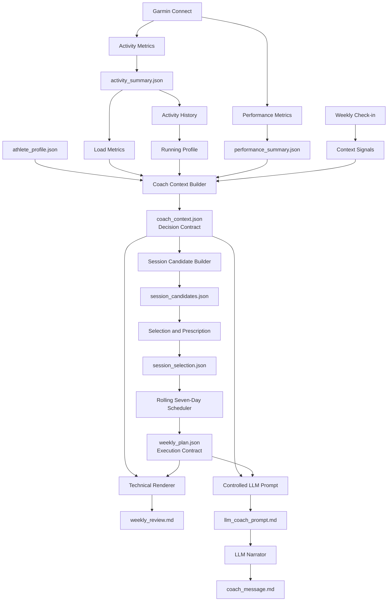

# Garmin Coach Lab

Garmin Coach Lab is a **local-first, context-aware endurance coaching prototype** that combines wearable activity data, short-term life context, deterministic decision rules, and a deterministic weekly planner to produce explainable rolling seven-day training plans.

The project began as an exploration of Garmin activity data and evolved into a layered decision and planning system:

```text
Garmin activity data
→ Activity history and training profile
→ Load metrics
→ Context-aware decision engine
→ Session candidate generation
→ Session selection and prescription
→ Rolling seven-day scheduling
→ Technical review
→ Controlled LLM narration
```

The core idea is simple:

> Garmin knows what I did.  
> It does not fully know what my current week allows.  
> A useful coaching system needs both.

The operating principle is:

> **Rules understand the situation.  
> The planner builds the week.  
> The LLM tells the story.**

---

## Why this project exists

Wearable platforms provide useful signals such as:

- activity type
- duration
- distance
- heart rate
- pace
- training history
- performance estimates

However, they do not fully understand short-term real-life constraints such as:

- travel or vacation
- family responsibilities
- work stress
- poor sleep
- mental fatigue
- active illness
- pain during running
- available training days
- maximum realistic session count
- maximum session duration
- access to a bike or indoor trainer

Garmin Coach Lab adds this missing context layer and applies it before a weekly plan is created.

For example:

```text
Garmin data:
- recent training volume is below baseline
- no cycling sessions were completed

Default direction:
- rebuild consistency
- consider an easy aerobic session

Weekly context:
- user is travelling
- bike and trainer are unavailable
- running is available
- only one session is realistic
- total session duration must stay below 45 minutes

Final result:
- one easy run
- short mobility/core add-on
- no cycling
- no interval, tempo, or long-run prescription
```

---

## Current status

This repository is a **single-user local MVP**.

It can currently:

- fetch recent Garmin activity summaries
- normalize a rolling 30-day activity history
- build a compact running profile
- fetch Garmin Race Predictor values as non-binding fitness signals
- calculate recent training load and weekly baseline metrics
- classify load progression deterministically
- collect weekly life, health, recovery, availability, and equipment context
- derive reusable context signals
- produce an explainable deterministic coaching decision
- generate valid session candidates
- select sessions under capacity constraints
- prescribe duration and intensity limits
- provide non-binding pace and distance guidance when data is available
- schedule selected sessions across a rolling seven-day horizon
- preserve intermediate planning artifacts for debugging and lineage
- render a technical weekly Markdown review
- generate a constrained LLM prompt
- generate a user-facing coach message through the OpenAI API
- validate decision and planning behavior with scenario and integration tests
- provide a local Streamlit check-in and technical report interface

The current UI does **not yet** provide a dedicated weekly-plan card or calendar experience. That is the next product milestone.

---

## System architecture



---

## Decision Engine vs Planning Engine

The project deliberately separates **decisioning** from **planning**.

### Decision Engine

The Decision Engine answers:

```text
What is safe, realistic, and allowed this week?
```

It considers:

- recent training load
- progression state
- athlete goals
- weekly intent
- illness and pain
- recovery constraints
- life load
- available modalities
- maximum sessions
- maximum session duration

Its main serving artifact is:

```text
data/coach_context.json
```

Typical decisions include:

```json
{
  "weekly_load": "restart_easy",
  "running": "easy_only",
  "cycling": "not_available",
  "strength_or_mobility": "optional",
  "priority": "consistency",
  "planning_limits": {
    "max_sessions": 1,
    "max_session_duration_min": 45,
    "available_modalities": [
      "running",
      "strength_or_mobility"
    ]
  }
}
```

### Planning Engine

The Planning Engine answers:

```text
Given the decision and constraints, what exactly should be scheduled?
```

It performs three deterministic stages:

```text
Session candidates
→ Session selection and prescription
→ Rolling seven-day scheduling
```

Its final serving artifact is:

```text
data/weekly_plan.json
```

The Decision Engine and Planning Engine are versioned independently because a scheduling-policy change does not necessarily change the coaching decision.

---

## Weekly Plan Builder

### 1. Candidate generation

The candidate builder converts the final decision into valid training options.

Example:

```text
running_easy
- standalone
- recommended
- capacity cost: 1

mobility_core
- add-on
- optional
- capacity cost: 0

cycling
- blocked because no bike or trainer is available
```

Candidate generation does not assign final dates or choose every valid option.

### 2. Selection and prescription

The selection layer:

- respects `max_sessions`
- ranks valid standalone candidates
- preserves non-selected candidates for explainability
- attaches add-ons without consuming a second standalone slot
- assigns duration targets and ranges
- applies intensity caps
- derives non-binding pace guidance when running-profile data exists
- derives approximate non-binding distance guidance
- never invents pace or distance when the training profile is unavailable

### 3. Rolling seven-day scheduling

The scheduler:

- uses an inclusive rolling seven-day horizon
- respects available weekdays
- avoids placing two standalone sessions on the same day
- spreads multiple sessions across the horizon
- attaches add-ons to the main session date
- returns alternatives where possible
- marks sessions as unscheduled instead of silently stacking them when available days are insufficient

---

## Planning priorities

The current MVP applies this priority order:

```text
1. Health and pain constraints
2. Available modalities
3. Maximum session count
4. Maximum total session duration
5. Intensity cap
6. Target duration
7. Non-binding pace reference
8. Approximate non-binding distance
```

Pace and distance are secondary guidance.

For easy running, the primary instruction is:

```text
conversational effort
```

A recent observed pace is not automatically treated as an easy-run target.

---

## Example weekly plan

The following is a simplified anonymized example:

```json
{
  "plan_status": "ready",
  "planning_horizon": {
    "type": "rolling_7_days",
    "start_date": "2026-07-31",
    "end_date": "2026-08-06"
  },
  "session_count": 1,
  "sessions": [
    {
      "date": "2026-08-03",
      "day_label": "Monday",
      "type": "easy_run",
      "duration_target_min": 35,
      "session_total_duration_target_min": 43,
      "intensity_cap": "easy",
      "pace_guidance": {
        "available": true,
        "binding": false,
        "target_reference": "6:34/km",
        "range": "6:28-6:49/km"
      },
      "distance_guidance": {
        "available": true,
        "binding": false,
        "target_km": 5.3
      },
      "add_ons": [
        {
          "type": "mobility_core",
          "duration_target_min": 8
        }
      ]
    }
  ]
}
```

The pace and distance values in this example are references, not pass/fail targets.

---

## Artifact lineage

### Local source and input artifacts

| Artifact | Role |
|---|---|
| `athlete_profile.json` | Local athlete goals, constraints, equipment, and weekly targets |
| `data/activity_summary.json` | Garmin activity history, aggregates, and running profile |
| `data/performance_summary.json` | Garmin performance signals |
| `data/manual_context.json` | Weekly life, recovery, health, availability, and equipment check-in |

### Decision serving artifact

| Artifact | Role |
|---|---|
| `data/coach_context.json` | Deterministic decision contract |

### Planning lineage artifacts

| Artifact | Role |
|---|---|
| `data/session_candidates.json` | Valid, blocked, standalone, and add-on candidates |
| `data/session_selection.json` | Capacity-aware selection and session prescription |

### Planning serving artifact

| Artifact | Role |
|---|---|
| `data/weekly_plan.json` | Deterministic rolling seven-day execution contract |

### Presentation artifacts

| Artifact | Role |
|---|---|
| `data/weekly_review.md` | Technical and explainable weekly report |
| `data/llm_coach_prompt.md` | Constrained narration contract |
| `data/coach_message.md` | User-facing coach message |

`session_candidates.json` and `session_selection.json` are primarily debugging and lineage artifacts. `coach_context.json` and `weekly_plan.json` are the main serving contracts.

---

## Project structure

```text
garmin-coach-lab-clean/
  README.md
  .gitignore
  requirements.txt
  .env.example

  athlete_profile.example.json
  athlete_profile.json              # local only, ignored by Git

  app.py
  activity_metrics.py
  performance_metrics.py
  build_coach_context.py
  update_manual_context.py

  build_session_candidates.py
  build_session_selection.py
  build_weekly_plan.py

  weekly_review.py
  generate_llm_prompt.py
  generate_coach_message.py
  run_pipeline.py

  project_inventory.py

  coach_engine/
    context/
      context_signals.py

    metrics/
      activity_history.py
      load_metrics.py
      training_profile.py

    rules/
      progression.py

    planning/
      session_candidates.py
      session_selection.py
      scheduling.py
      weekly_plan.py

    reporting/
      weekly_markdown.py

    narration/
      llm_prompt.py
      llm_client.py

  scenarios/
    scenario_matrix.json
    weekly_plan_scenario_matrix.json

  docs/
    PHASE_8_1_CHECKLIST.md

  data/
    .gitkeep

    activity_summary.json            # local/generated, ignored
    performance_summary.json         # local/generated, ignored
    manual_context.json              # local/generated, ignored
    coach_context.json               # local/generated, ignored
    session_candidates.json          # local/generated, ignored
    session_selection.json           # local/generated, ignored
    weekly_plan.json                 # local/generated, ignored
    weekly_review.md                 # local/generated, ignored
    llm_coach_prompt.md              # local/generated, ignored
    coach_message.md                 # local/generated, ignored

    samples/
      activity_summary.sample.json
      performance_summary.sample.json
      manual_context.sample.json
```

---

## Setup

The project is designed to run locally with Python.

### 1. Create and activate a virtual environment

On Windows:

```cmd
python -m venv .venv
.\.venv\Scriptsctivate
```

### 2. Install dependencies

```cmd
python -m pip install -r requirements.txt
```

### 3. Configure optional LLM access

Copy the example environment file:

```cmd
copy .env.example .env
```

Then set:

```text
OPENAI_API_KEY=your_openai_api_key_here
```

The deterministic decision and planning pipeline does not require the OpenAI API.

The API key is only required when generating `coach_message.md`.

### 4. Create the local athlete profile

```cmd
copy athlete_profile.example.json athlete_profile.json
```

Edit `athlete_profile.json` with local goals, constraints, equipment, and weekly targets.

This file is ignored by Git because it may contain personal information.

### 5. Garmin authentication

Garmin access is handled locally through the `garminconnect` Python package.

Authentication tokens are stored outside the repository. The Streamlit interface does not collect Garmin passwords.

Do not commit Garmin credentials or token files.

---

## Weekly workflow

### 1. Sync the watch

Garmin activities must first be synchronized to Garmin Connect.

### 2. Update the weekly context

The Streamlit interface is the recommended check-in workflow:

```cmd
streamlit run app.py
```

A command-line context updater is also available:

```cmd
python update_manual_context.py
```

Both workflows update:

```text
data/manual_context.json
```

### 3. Run the complete pipeline

```cmd
python run_pipeline.py
```

This performs:

```text
Activity Metrics
→ Performance Metrics
→ Coach Context
→ Deterministic Weekly Plan
→ Weekly Review
→ Controlled LLM Prompt
→ User-Facing Coach Message
```

### 4. Run without refreshing Garmin data

```cmd
python run_pipeline.py --skip-garmin
```

### 5. Run without calling the LLM

```cmd
python run_pipeline.py --skip-llm
```

### 6. Run only deterministic local steps

```cmd
python run_pipeline.py --skip-garmin --skip-llm
```

### 7. Reproduce a fixed planning horizon

```cmd
python run_pipeline.py ^
  --skip-garmin ^
  --skip-llm ^
  --plan-start-date 2026-07-31
```

A fixed planning start date is useful for reproducible tests and demonstrations.

---

## Running individual stages

### Refresh activity metrics

```cmd
python activity_metrics.py
```

### Refresh performance metrics

```cmd
python performance_metrics.py
```

### Build the decision contract

```cmd
python build_coach_context.py
```

### Build the full weekly plan

```cmd
python build_weekly_plan.py
```

With a fixed start date:

```cmd
python build_weekly_plan.py --start-date 2026-07-31
```

### Render the technical weekly review

```cmd
python weekly_review.py
```

### Generate the controlled LLM prompt

```cmd
python generate_llm_prompt.py
```

### Generate the user-facing message

```cmd
python generate_coach_message.py
```

---

## Pipeline preflight checks

`run_pipeline.py` performs lightweight checks before execution.

Depending on the selected pipeline mode, it validates:

- active Python executable
- working directory
- required local scripts
- existing local source artifacts when Garmin refresh is skipped
- `garminconnect` availability when Garmin refresh is enabled
- planning-module imports
- OpenAI package availability when LLM generation is enabled
- `OPENAI_API_KEY` availability when LLM generation is enabled

This helps diagnose environment and virtual-environment issues before the pipeline reaches a later stage.

---

## Testing

The project currently uses explicit local runners and scenario matrices.

### Context-aware decision scenarios

```cmd
python run_scenario_matrix.py
```

The current matrix covers multiple life, health, recovery, availability, and equipment contexts.

### Session candidate tests

```cmd
python run_session_candidate_tests.py
```

### Session selection and prescription tests

```cmd
python run_session_selection_tests.py
```

### Scheduling tests

```cmd
python run_weekly_scheduling_tests.py
```

### Weekly Plan Builder facade tests

```cmd
python run_weekly_plan_builder_tests.py
```

### Weekly planning scenario matrix

```cmd
python run_weekly_plan_scenario_matrix.py
```

The current planning matrix includes scenarios such as:

- one-session easy run with a mobility add-on
- active illness hard stop
- trainer-only availability
- recovery-priority selection
- capacity overflow
- tight 25-minute limit
- 20-minute limit that drops the add-on
- missing training profile
- restricted available days
- Turkish weekday aliases
- empty available-days semantics

### Weekly-plan propagation tests

```cmd
python run_weekly_plan_propagation_tests.py
```

These validate:

```text
weekly_plan.json
→ weekly_review.md
→ llm_coach_prompt.md
```

### Recommended complete local verification

```cmd
python run_scenario_matrix.py && ^
python run_session_candidate_tests.py && ^
python run_session_selection_tests.py && ^
python run_weekly_scheduling_tests.py && ^
python run_weekly_plan_builder_tests.py && ^
python run_weekly_plan_scenario_matrix.py && ^
python run_weekly_plan_propagation_tests.py && ^
python run_pipeline.py --skip-garmin --skip-llm
```

A single consolidated test entry point is planned during Phase 8.1.

---

## Streamlit interface

Start the local application with:

```cmd
streamlit run app.py
```

The current interface supports:

- Garmin summary cards
- context-aware decision summary
- Weekly Check-in v2
- availability and equipment inputs
- recovery and life-load inputs
- progressive pain and health inputs
- user notes
- local artifact status
- technical weekly review
- coach message
- debug context inspection
- local feedback logging

The dedicated weekly-plan product screen is not implemented yet.

Planned Phase 9 UI capabilities include:

- weekly focus card
- plan horizon
- session cards
- main and total duration
- intensity guidance
- non-binding pace and distance references
- mobility/core add-ons
- alternative dates
- “Why this plan?” explanations

---

## LLM boundary and guardrails

The LLM is a narration layer, not a decision or planning layer.

By the time the LLM is called, the system has already determined:

- weekly load direction
- allowed modalities
- maximum sessions
- maximum total duration
- selected sessions
- selected dates
- intensity caps
- add-ons
- pace binding status
- distance binding status
- blocked workout types

The prompt contains explicit immutable sections:

```text
FINAL DECISION — DO NOT CHANGE
WEEKLY PLAN — DO NOT CHANGE
```

The LLM is instructed not to:

- add sessions
- change dates
- change durations
- change the selected modality
- add interval, tempo, or long-run work
- present non-binding pace as a mandatory target
- present approximate distance as a pass/fail goal
- turn unscheduled candidates into extra tasks
- provide unsupported medical advice

A failure in the LLM layer does not prevent the deterministic plan from being generated.

---

## Design principles

### Rules decide, planner schedules, LLM explains

```text
Decision Engine:
What is safe and realistic?

Planning Engine:
What should be scheduled?

LLM:
How should the result be explained?
```

### Health constraints outrank performance goals

Active illness, severe pain, or running-related pain can block structured training regardless of weekly intent.

### Feasibility before optimization

A theoretically ideal workout is not useful if the user lacks time, equipment, or a realistic training day.

### Duration and effort before pace and distance

For easy sessions:

```text
effort
→ duration
→ non-binding pace reference
→ approximate distance
```

### Missing data must not create invented precision

If a running profile is unavailable, the system does not invent pace or distance guidance.

### Intermediate artifacts are part of explainability

The system preserves the path from decision to execution:

```text
coach_context
→ session_candidates
→ session_selection
→ weekly_plan
```

### Renderers do not calculate business logic

Markdown and LLM-prompt renderers consume prepared artifacts. They do not create or change decisions.

---

## Data and privacy

The project may process sensitive information, including:

- health and training data
- activity summaries
- life-context notes
- pain notes
- local athlete profile
- Garmin authentication tokens
- API keys
- generated weekly plans
- feedback logs

Keep the following local and outside version control:

```text
.env
athlete_profile.json
data/activity_summary.json
data/performance_summary.json
data/manual_context.json
data/coach_context.json
data/session_candidates.json
data/session_selection.json
data/weekly_plan.json
data/weekly_review.md
data/llm_coach_prompt.md
data/coach_message.md
data/feedback_log.jsonl
docs/PROJECT_INVENTORY.md
```

Use anonymized sample artifacts under `data/samples/` for public demonstrations.

The application does not collect Garmin passwords through the Streamlit UI.

---

## Current limitations

The current MVP does not yet:

- track whether a planned session was completed
- reconcile planned sessions with later Garmin activities
- maintain plan history
- adapt rules from user feedback
- provide a dedicated plan calendar UI
- prescribe intervals, tempo runs, long runs, or race-specific blocks
- model terrain, temperature, wind, or route difficulty
- normalize pace for elevation
- provide medical diagnosis
- support multiple users
- provide cloud authentication or hosted secret management
- write workouts back to Garmin

These are explicit product boundaries, not hidden capabilities.

---

## Roadmap to v1.0

### Phase 8.1 — Consolidation

- update architecture and repository documentation
- standardize artifact contracts and metadata
- consolidate tests under one entry point
- simplify the technical weekly review
- complete a privacy and tracked-file verification

### Phase 9 — Weekly Plan Product UI

- weekly-plan summary cards
- session cards
- alternative-date display
- “Why this plan?” explanations
- clearer separation between product and debug views

### Phase 10 — Plan Execution and Feedback

- plan history
- session completion states
- rescheduling and skipping
- Garmin activity reconciliation
- session difficulty feedback
- weekly outcome artifact

### Phase 11 — Deterministic Personalization

- adherence metrics
- recent difficulty trends
- recent pain-event signals
- duration-tolerance updates
- feedback-aware deterministic rules

### Phase 12 — Quality and Release Hardening

- formal artifact validation
- safety-matrix expansion
- data freshness warnings
- idempotency and replay tests
- controlled failure handling
- privacy review

### Phase 13 — Portfolio and v1.0 Release

- final architecture assets
- public demo scenarios
- product screenshots
- short demo video
- technical case study
- tagged `v1.0.0` release

Possible post-v1.0 work:

- Garmin workout export
- calendar integration
- mobile client
- hosted multi-user service

---

## Portfolio value

Garmin Coach Lab demonstrates:

- wearable-data ingestion
- normalization and serving layers
- derived training metrics
- schema evolution
- rule-based decision systems
- context modeling
- constraint propagation
- deterministic planning
- scheduling
- explainability and lineage
- constrained LLM generation
- scenario-based validation
- local-first product design
- privacy-aware engineering
- product thinking

The most important technical challenge was not text generation.

It was separating:

```text
evidence
→ decisions
→ constraints
→ planning
→ scheduling
→ narration
```

so that every recommendation remained deterministic, testable, and explainable.

---

## Disclaimer

Garmin Coach Lab is an experimental personal coaching assistant.

It is not medical advice, does not diagnose illness or injury, and must not replace a qualified coach, doctor, or physiotherapist.

Garmin Race Predictor values are treated as fitness signals, not direct race targets.

---

## Acknowledgements

The project was inspired by experiments with Garmin Connect data and the Garmin MCP ecosystem.

Garmin data access in the local prototype uses the `garminconnect` Python package.

This repository is an independent personal project and is not affiliated with Garmin.

---

## License

No open-source license has been selected.

Copyright © 2026 Kamil Gün. All rights reserved.

This repository is shared publicly for portfolio and educational purposes. Please do not reuse, redistribute, or commercialize the code without permission.

---

## Author

**Kamil Gün**
